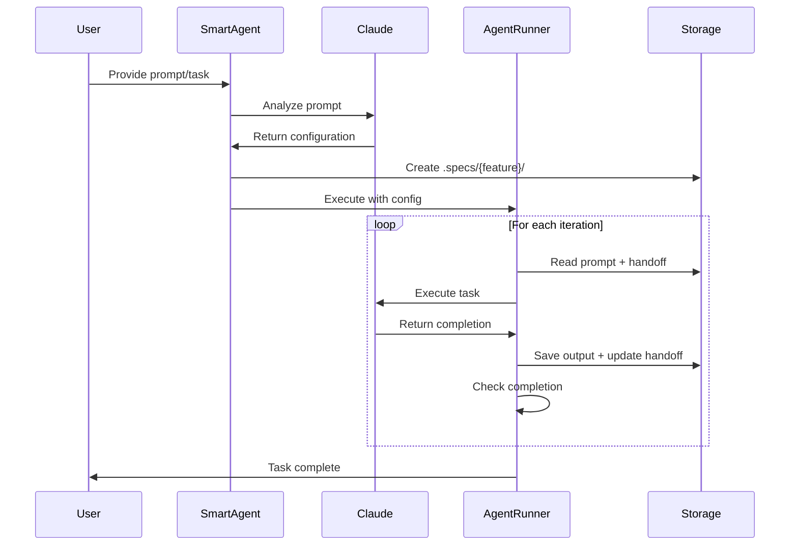
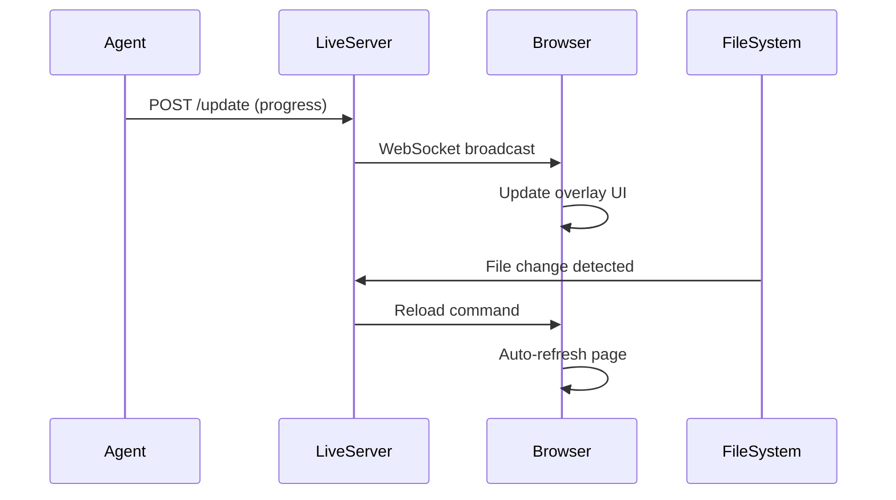
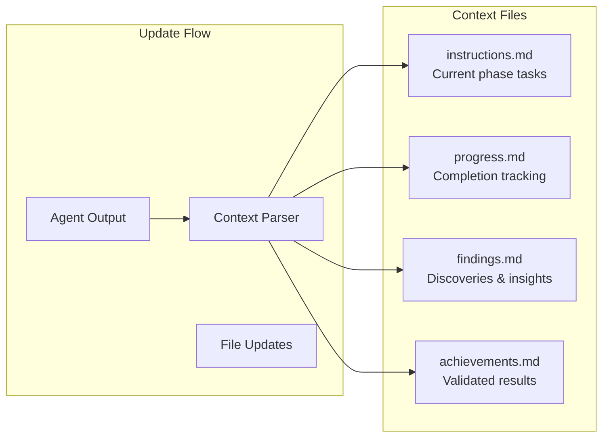
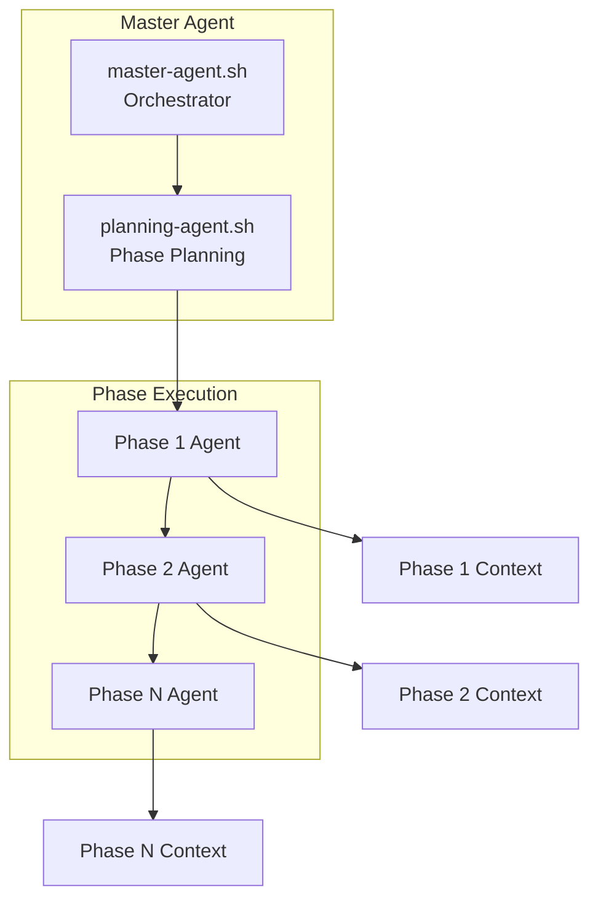

# While Loopin' Claude - System Architecture

[← Back to README](README.md) | [Quick Start →](QUICK-START.md) | [API Spec →](API-SPEC.md) | [Dev Guide →](CLAUDE.md)

---

## Overview

While Loopin' Claude is an AI-orchestrated autonomous agent system that enables Claude to run in iterative loops until task completion. The architecture consists of three core shell scripts that work together to provide intelligent task execution with optional live preview capabilities.

## System Components

```mermaid
graph TB
    subgraph "User Interface Layer"
        CLI[CLI Input]
        Browser[Live Browser Preview]
        Terminal[Terminal Output]
    end

    subgraph "Orchestration Layer"
        SmartAgent[smart-agent.sh<br/>AI Orchestrator]
        AgentRunner[agent-runner.sh<br/>Execution Engine]
    end

    subgraph "Core Services"
        ClaudeFunctions[claude-functions.sh<br/>Utility Functions]
        ContextFunctions[context-functions.sh<br/>Context Management]
        LiveServer[live-server.js<br/>WebSocket Server]
    end

    subgraph "Optional Components"
        CodeReview[code-review.sh<br/>Quality Assurance]
        MasterAgent[master-agent.sh<br/>Multi-Phase Orchestration]
        PhaseAgent[phase-agent.sh<br/>Phase Execution]
    end

    subgraph "AI Provider"
        Claude[Claude API<br/>Sonnet/Opus/Haiku]
    end

    subgraph "Storage Layer"
        Specs[.specs/{feature}/<br/>Feature Specifications]
        AgentRuns[.ai-dr/agent-runs/<br/>Execution Logs]
        Handoffs[HANDOFF.md<br/>State Management]
        Context[context/<br/>Context Files]
    end

    CLI --> SmartAgent
    SmartAgent --> AgentRunner
    AgentRunner --> ClaudeFunctions
    AgentRunner --> ContextFunctions
    AgentRunner --> Claude
    AgentRunner --> Handoffs
    AgentRunner --> AgentRuns

    SmartAgent --> Specs
    SmartAgent --> Claude

    LiveServer --> Browser
    AgentRunner -.->|optional| LiveServer
    AgentRunner -.->|optional| CodeReview

    MasterAgent -.->|multi-phase| PhaseAgent
    PhaseAgent --> AgentRunner

    ClaudeFunctions --> Claude
    ContextFunctions --> Context
    CodeReview --> Claude
```

## Core Architecture Pattern

### 1. Smart Agent Analysis Phase

The system starts with AI-driven analysis of the user's prompt to determine optimal configuration:

```
User Prompt → smart-agent.sh → Claude Analysis → JSON Configuration
                                      ↓
                              Determines:
                              • Task complexity
                              • Max iterations needed
                              • Feature name (kebab-case)
                              • Code review requirements
                              • Relevant files
                                      ↓
                              Creates .specs/{feature}/
```

### 2. Agent Execution Loop

The main execution follows an iterative pattern with state management:

```
┌─────────────────────────────────────────┐
│         agent-runner.sh Loop            │
├─────────────────────────────────────────┤
│                                         │
│  For iteration 1 to MAX:                │
│    1. Read prompt + handoff            │
│    2. Execute Claude (Sonnet)          │
│    3. Save output to .ai-dr/           │
│    4. Update context files             │
│    5. Generate/update handoff          │
│    6. Check completion status          │
│    7. Rate limit (15s default)         │
│                                         │
│  If "Status: complete" → EXIT          │
│  Else → CONTINUE with context          │
│                                         │
└─────────────────────────────────────────┘
```

### 3. Optional Code Review Cycle

Post-execution quality assurance:

```
After main loop:
  ↓
Review Cycle (1 to MAX_REVIEWS):
  1. Generate review prompt
  2. Claude reviews code
  3. Extract JSON (score, fixes)
  4. If score >= 8 → PASS
  5. Apply critical fixes
  6. Run lint & typecheck
  7. Rate limit (15s)
  8. Re-review until pass
```

## Data Flow Architecture

### Request Flow



### Live Mode Data Flow



## File System Architecture

```
while-loopin-claude/
├── lib/                              # Core system libraries
│   ├── agent-runner.sh              # Main execution engine
│   ├── claude-functions.sh          # Reusable utilities
│   ├── smart-agent.sh               # AI orchestrator
│   ├── context-functions.sh         # Context management (new)
│   ├── master-agent.sh              # Multi-phase orchestration (new)
│   ├── phase-agent.sh               # Phase execution wrapper (new)
│   ├── planning-agent.sh            # Planning separation (new)
│   ├── handoff-functions.sh         # Handoff management
│   ├── code-review.sh              # Quality review cycle
│   └── live-server.js              # WebSocket server
│
├── .specs/                          # Feature specifications
│   └── {feature-name}/              # Per-feature directory
│       ├── AGENT-PROMPT.md          # Enhanced prompt
│       ├── HANDOFF.md               # Current state
│       ├── analysis.json            # AI configuration
│       ├── README.md                # Feature navigation
│       ├── context/                 # Context tracking (new)
│       │   ├── instructions.md
│       │   ├── progress.md
│       │   ├── findings.md
│       │   └── achievements.md
│       └── master-context/          # Multi-phase tracking (new)
│           ├── phases.json
│           ├── agents.json
│           └── coordination.log
│
├── .ai-dr/                          # Agent outputs
│   ├── agent-runs/                  # Execution logs
│   │   └── {feature}/               # Per-feature runs
│   │       └── {timestamp}/         # Timestamped sessions
│   │           ├── iteration_1.log
│   │           ├── iteration_2.log
│   │           └── ...
│   └── prompts/                     # Saved prompts
│       └── {date}/                  # Daily organization
│
└── examples/                        # Demo applications
    └── color-art-app/               # Main demo
        ├── index.html               # Web application
        ├── run-agent.sh             # Basic runner
        ├── run-agent-live.sh        # Live mode runner
        └── HANDOFF.md               # Demo state
```

## Component Details

### claude-functions.sh (Core Utilities)

**Purpose**: Provides reusable functions for all components

**Key Functions**:
- `run_claude()` - Execute Claude and save output
- `run_claude_json()` - Execute expecting JSON response
- `generate_structured_output()` - Extract JSON from text
- `prompt_text()`, `prompt_select()`, `prompt_confirm()` - Interactive prompts
- `play_alert()`, `speak_prompt()` - User feedback
- `update_live_progress()` - WebSocket integration

### agent-runner.sh (Execution Engine)

**Purpose**: Manages the iterative agent execution loop

**Key Functions**:
- `run_claude_agent()` - Main loop with handoff management
- `generate_continuation_prompt()` - Create iteration prompts
- `run_code_review_cycle()` - Optional quality review
- `process_critical_fixes()` - Apply review feedback

**Features**:
- Configurable max iterations
- Automatic handoff creation/updates
- Completion detection
- Rate limiting
- Speech feedback (macOS)

### smart-agent.sh (AI Orchestrator)

**Purpose**: Analyzes prompts and determines optimal configuration

**Process**:
1. Takes user prompt (text or file)
2. Uses Claude to analyze complexity
3. Determines configuration dynamically
4. Creates feature directory structure
5. Invokes agent-runner with config

**AI Determines**:
- Task type and complexity
- Feature name (kebab-case slug)
- Maximum iterations needed
- Code review requirements
- Relevant files to include

### Context System Architecture (New)

The context framework adds persistent state tracking:



### Multi-Phase Architecture (New)

For complex tasks requiring multiple phases:



## Extension Points

### 1. Custom Prompt Templates

Add templates to `.claude/agents/` for specialized behaviors:
- Review templates
- Domain-specific prompts
- Custom instruction sets

### 2. SDK Adapters

The pattern is language-agnostic and can be implemented in:
- Python (using Anthropic SDK)
- TypeScript/JavaScript (Node.js)
- Go (with HTTP client)
- Any language with API access

### 3. Storage Backends

Current file-based storage can be extended to:
- Database storage (SQLite, PostgreSQL)
- Cloud storage (S3, GCS)
- Version control integration

### 4. Monitoring & Metrics

Hook points for adding:
- Execution metrics
- Token usage tracking
- Performance monitoring
- Error tracking

## Performance Characteristics

### Timing
- **Iteration delay**: 15 seconds (configurable)
- **Review delay**: 15 seconds
- **Fix application delay**: 2 seconds
- **Live update latency**: < 100ms

### Resource Usage
- **Memory**: Minimal (shell scripts)
- **CPU**: Low (waiting between iterations)
- **Network**: API calls only
- **Disk**: Logs grow with iterations

### Scalability
- **Concurrent features**: Unlimited (separate directories)
- **Max iterations**: Configurable (default 10)
- **Output size**: No hard limits
- **File watching**: Efficient (inotify/FSEvents)

## Security Considerations

### API Keys
- Stored in Claude CLI configuration
- Never logged or exposed
- Accessed via `claude` command

### File System
- All operations in project directory
- No system file modifications
- Temporary files cleaned up

### Code Execution
- Agent output not auto-executed
- Manual review recommended
- Sandboxed to project directory

## Best Practices

### 1. Prompt Engineering
- Be specific about requirements
- Include success criteria
- Provide context and constraints

### 2. Configuration
- Let AI determine complexity
- Override only when necessary
- Use appropriate models (Haiku for speed, Sonnet for complexity)

### 3. Monitoring
- Check handoff status regularly
- Review agent outputs
- Validate completion criteria

### 4. Testing
- Start with small iterations
- Test in isolated environment
- Verify no regressions

## Future Enhancements

### Planned Features
1. **Plugin System** - Extensible components
2. **Parallel Execution** - Multiple agents
3. **Replay Mode** - Re-run from saved state
4. **VS Code Integration** - Editor extension
5. **Metrics Dashboard** - Historical tracking

### Architecture Evolution
- Microservices option for scalability
- GraphQL API for flexible queries
- Event-driven architecture for real-time updates
- Container orchestration support

## Conclusion

While Loopin' Claude demonstrates a clean, composable architecture for AI-orchestrated development. The system's strength lies in its simplicity, modularity, and AI-first approach where configuration is determined dynamically rather than hard-coded. The addition of context tracking and multi-phase orchestration extends its capabilities while maintaining backward compatibility.